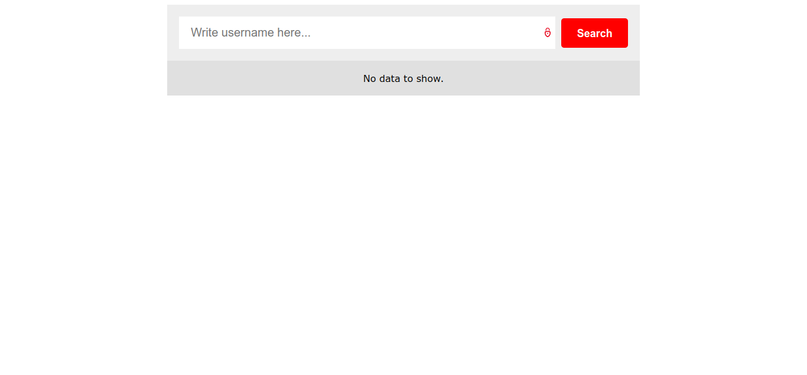
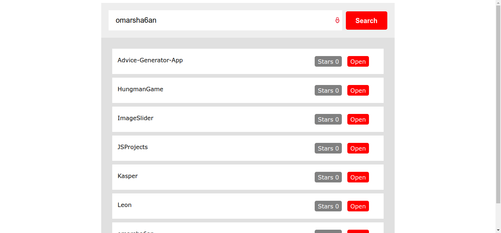

# Repos Viewer

### Show GitHub repositories in an organized style and some other information

## Screenshots

  

  

## Used Tools

- HTML
- CSS
- JAVASCRIPT

## Demo

<a href="https://omarsha6an.github.io/JSProjects/09-ReposViewer/index.html">Click Here</a>
